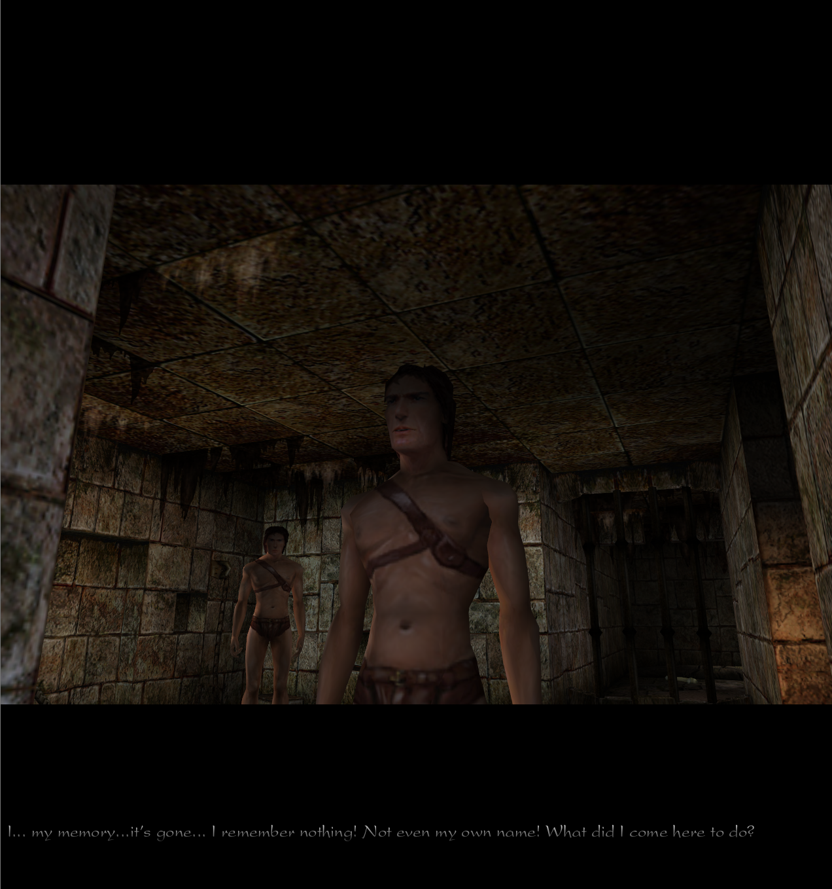
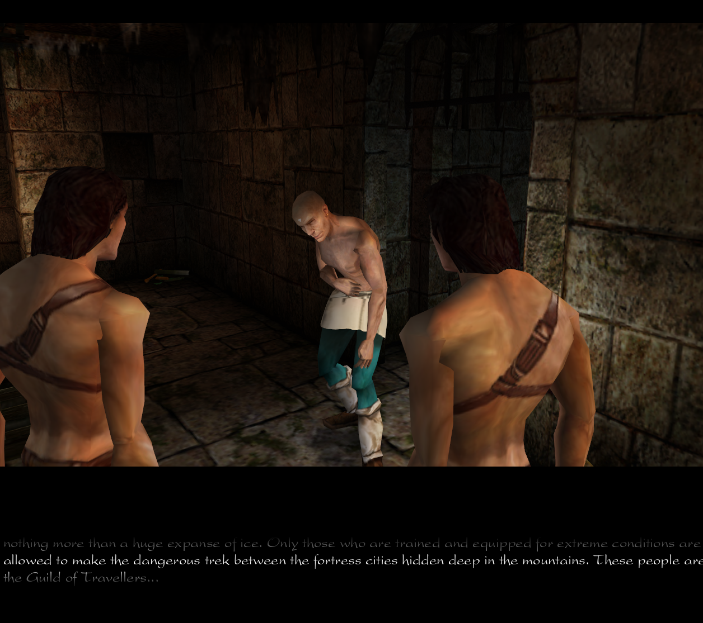
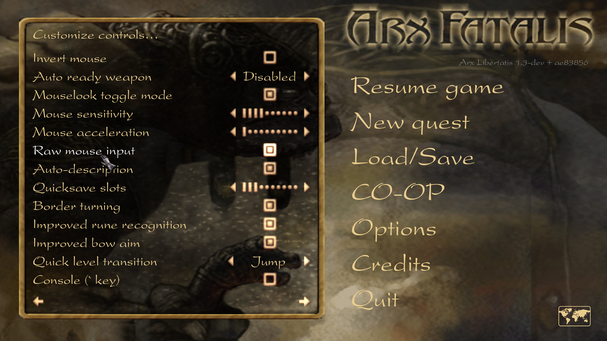
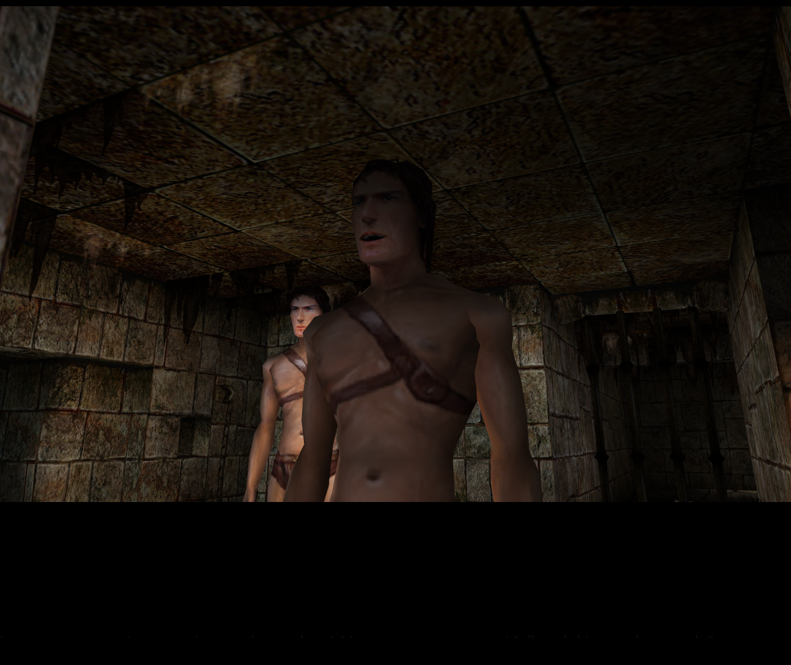

# Arx Fatalis Co-op

**Two players, one Arx.** A co-op mod for [Arx Libertatis](https://arx-libertatis.org/),
the open source version of Arkane Studios' *Arx Fatalis*.

> ### ⚠️ WORK IN PROGRESS - EXPECT ANYTHING
>
> This is early. It will have problems. Things will break in ways nobody has
> seen yet, because almost nobody has played it yet. If that sounds like fun,
> read on. If you want something polished, come back later.


*One room, two screens. Each player sees the other move, fight, and pick things up.*

---

**This is free.** The only official download is the
[Releases page](https://github.com/kingzmanh/arx-fatalis-coop/releases) of this
repository. If you paid for it, you were charged for something I am giving away
for free.

## Community

**[Join the Discord server](https://discord.gg/VrAyZ2VKrR)** - find a second
player in #find-a-partner, follow new releases in #updates, and talk to other
people playing Arx together.

**Found a bug?** Open a
[GitHub issue](https://github.com/kingzmanh/arx-fatalis-coop/issues) or post in
#bug-report on Discord. Say what you were doing, who was host, and attach the
log if you can - that last part is worth more than you would think.

## What this is

Arx Fatalis is a single player game. This makes it a two player one.

You can join anywhere in the game, not just at the beginning - whatever point
the host is at, you turn up there and carry on together.

One warning: if you join partway through for the first time, your character is
still level 1, and you will be dropped somewhere you are not ready for. Starting
from the beginning together is much better.



## Honest words about who made this

**I do not know how to code.** I built this by working with AI, step by step,
over a long time - testing, breaking things, finding out why, and going again.
It took far longer than I expected. There is a file in this repository called
[FIXES.md](FIXES.md) that lists every problem found and how it was solved,
which is probably the most honest record of how this was actually built.

So: this is not the work of an experienced engine programmer. It is the work of
someone stubborn with good tools. It runs, two people can play it, and I am
proud of that - but there will be things in here that make a real developer
wince.

**If anyone wants to help, I would genuinely appreciate it.** Bug reports,
fixes, or just telling me what broke and what you were doing at the time. That
last one is worth more than you would think.



## What Properly works

- **Seeing each other** - position, animation, the weapon in their hand
- **Fighting together** - creatures notice both of you and fight both of you
- **Items** - picking up, dropping, throwing, carrying
- **Doors, levers, and travelling between areas** together
- **Quests advance for either of you** - hand over a quest item as either player
  and it counts; whatever you get in return goes to the one who handed it over
- **Cutscenes play for whoever walks into them** - camera, black bars and
  dialogue, while the other player carries on. A slider on the co-op menu
  switches this to *player one only*
- **Either player can skip a scene** they are watching
- **Magic is learned together** - when either of you learns a rune, so does the
  other, and joining up shares whatever each of you already knew
- **Your own character** - made on the same creation screen the first player
  gets: your face, your attributes, your skills. Stats, inventory and gear are
  yours, saved on your own machine; rejoin the same game and your progress is
  still there
- **The world lives around both players** - anything near either of you is
  simulated, whether or not the other is anywhere close
- **Join anywhere in the game**, not just at the beginning
- **Both health bars** on screen, so you can see when your friend is in trouble
- **Friendly fire** - you can hurt each other, on purpose or otherwise
- **Proximity voice chat** - speak and it comes out of your character's mouth,
  fading with distance and coming from the direction you are standing in
- **A developer console**, off by default - turn it on under Options -> Control,
  then press ` . Teleport to any level and marker, spawn items, save and return
  to a spot, suppress the opening cinematic
- **Automatic port forwarding** - most routers will open the port by themselves,
  so hosting usually needs no setup



*The console is a switch like any other: **Options -> Control**, last line,
``Console (` key)``. Turn it on and the key wakes it up in game.*

## Spells

Two spells come with the mod. Both are cast the ordinary way - draw the runes -
and both do things single player Arx never had to do, because it never had a
second player to do them to.

| Spell | Runes | What it does | Mana |
|---|---|---|---|
| **Summon Co-op** | `yok` `aam` | Opens a rift where you are looking and your partner steps out of it, halfway through it opening. It reaches across the map, and across levels: if they are somewhere else entirely they travel and arrive at that spot, not at the level's front door. | half your mana pool |
| **Revive** | `mega` `yok` `aam` | Puts your dead partner back on their feet from wherever you are standing. | half your mana pool |

Standing over your dead partner no longer raises them - earlier versions did
that after two seconds, because co-op needed some way back. Revive is the way
back now.

A share of the pool means a share of your **full** pool, not what is left in
it: a share of what is left could always be paid, and a spell nobody can run
out of is not really a spell.

### Changing them, or writing your own

The spells are not in the program. They are in a text file that ships with the
mod:

    data\game\studio-spells.txt

Open it in Notepad. Every spell is a small block of lines - its runes, its
level, what it costs, the look and sound it wears - and the file lists every
rune name at the top. Change a line, start the game, cast it.

    spell revive
    name   Revive
    runes  MEGA YOK AAM
    level  2
    mana   50%              a number instead - "mana 12" - is a flat cost
    kind   revive_partner
    visual Heal
    sound  magic_spell_healing.wav

If you pick runes another spell already uses, that spell is left out rather
than fighting over them, and `arx.log` says which spell has them. Updating the
mod keeps your version of the file; the one the new version ships is left
beside it as `studio-spells-default.txt`.

## New and not yet tested

Built with care, not yet proven in a live game. If one of these misbehaves for
you, that report is exactly what we need:

- **Forced story moves take both players** - captures and story teleports used
  to strand whoever did not trigger them
- **Cutscenes that reposition their viewer move the right player**, not the
  host
- **Quests that ask you to pay now work for both players** - the barmaid's
  beer, the goblin lord, the ice dragon's toll - paid by either player, from
  their own purse

## What does not work yet

Being straight with you, because you will find these anyway:

- **Never properly tested over the internet.** Almost all testing has been two
  windows on one computer. Real latency will find bugs that local testing cannot.
- **Loot can duplicate** in some cases - both players may find their own copy.
- **Enemies sometimes pick the wrong target** in crowded fights.

## Playing it

**Full instructions, including how to remove it again, are in
[INSTALL.md](INSTALL.md).** The short version:

**You need to own Arx Fatalis.** This mod contains no game content at all -
no art, no sound, no levels. Buy it on
[GOG](https://www.gog.com/game/arx_fatalis) or
[Steam](https://store.steampowered.com/app/1560/Arx_Fatalis/), then point this
at your installation the same way you would Arx Libertatis.

**To host:** open the co-op menu, press HOST GAME, and give your friend your IP
address. The mod will try to open the port on your router automatically.

**To join:** type their address and press JOIN GAME.

**If it will not connect:** some internet providers put you behind a second
router that you cannot open ports on. The simple answer is a free virtual LAN
like [Radmin VPN](https://www.radmin-vpn.com/) or Hamachi - both players install
it, join the same network, and use the address it gives you.



## Voice chat

Turn on VOICE CHAT in the co-op menu and hold **V** to speak.

It is proximity based, not a phone call. Your voice comes out of your character,
so it gets quieter the further apart you are and arrives from the direction you
are standing in. Walk far enough away and your friend cannot hear you at all.

There is a **MIC TEST** on the same menu with a level meter, so you can check
your microphone before you rely on it. If nothing moves, click **MIC:** to try
a different microphone - modern machines are full of ones that look real and
are not.

## What I actually changed

This repository is Arx Libertatis with co-op added, so most of what you see
here is their work, not mine. If you want to read only my part, the branch
`upstream-base` marks the Arx Libertatis commit this started from:

**[See every co-op change as one diff](https://github.com/kingzmanh/arx-fatalis-coop/compare/upstream-base...master)**

Base is upstream commit
[5b95e4c](https://github.com/arx/ArxLibertatis/commit/5b95e4c5ca9d583f1b11c085326979772645e0f3)
(28 October 2023). Or from a clone:

```sh
git remote add upstream https://github.com/arx/ArxLibertatis.git
git fetch upstream
git diff upstream/master...master
```

**About `coop-source/`:** that folder is a standalone snapshot of the co-op
code as it stood at version 0.4 - `engine-changes.patch` plus copies of the
engine files it touches. It is kept as a record of that release, not as a
second copy of the current code. The code that builds and ships lives in
`src/`; if the two disagree, `src/` is right.

## Credits

This is built on other people's work, and a lot of it. See
**[CREDITS.md](CREDITS.md)** for the full list - but the short version:

**[Arx Libertatis](https://arx-libertatis.org/)** is the reason this exists at
all. A team of volunteers spent over a decade rebuilding Arx Fatalis into
something that still runs and can still be changed. Every line of co-op here
sits on top of that. Thank you.

**[Arkane Studios](https://www.arkane-studios.com/)** made Arx Fatalis in 2002,
and it is still unlike anything else.

## Licence

GPL v3, the same as Arx Libertatis - see [LICENSE](LICENSE). That means the
source is here, and anything built from it must stay open too.

---

*This is an unofficial fan project. Not affiliated with, endorsed by, or
connected to Arkane Studios or Bethesda Softworks. Arx Fatalis is their
trademark.*
